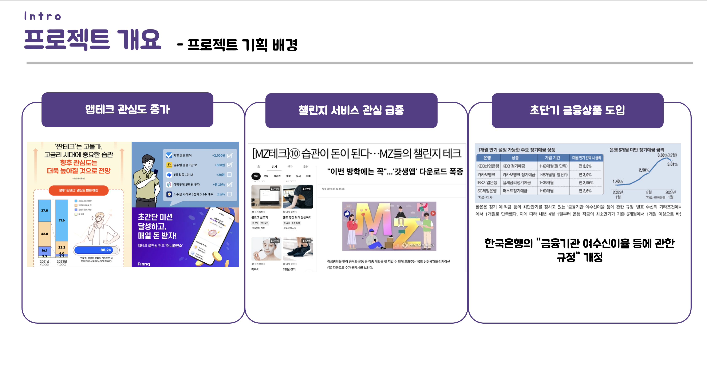
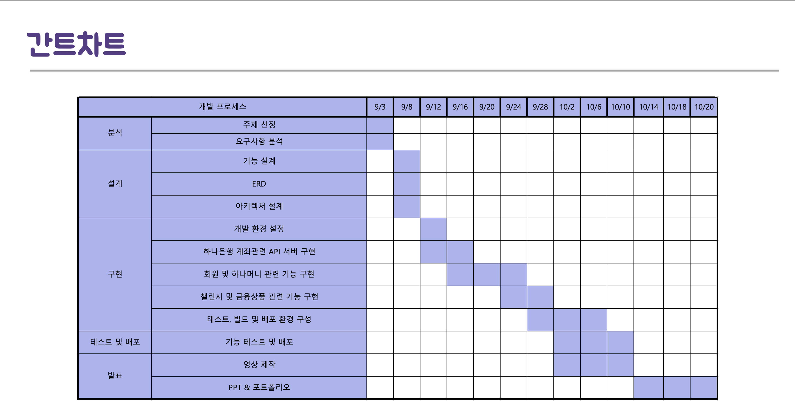
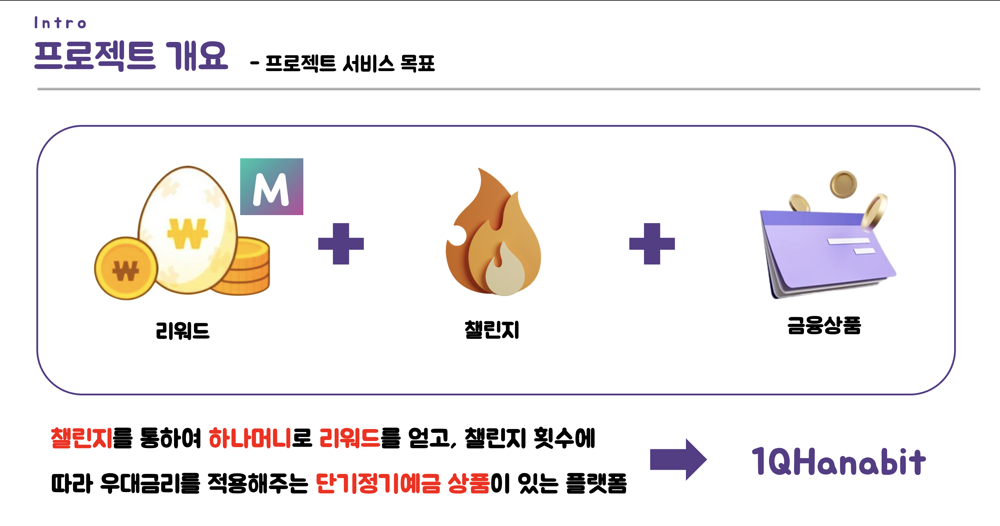
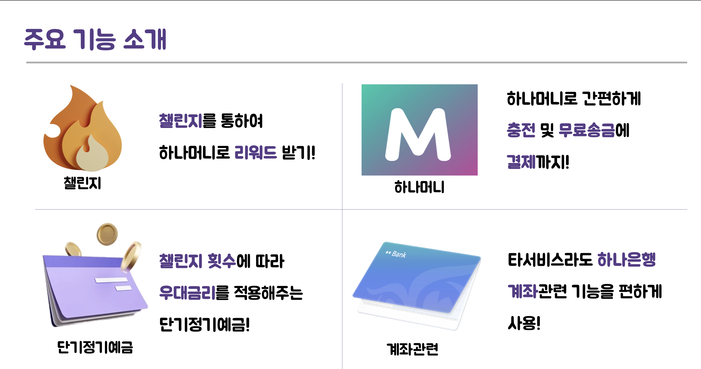
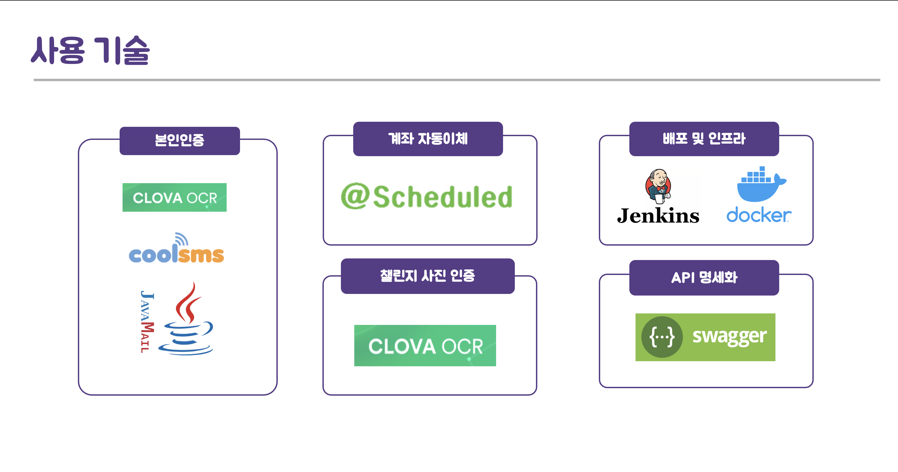
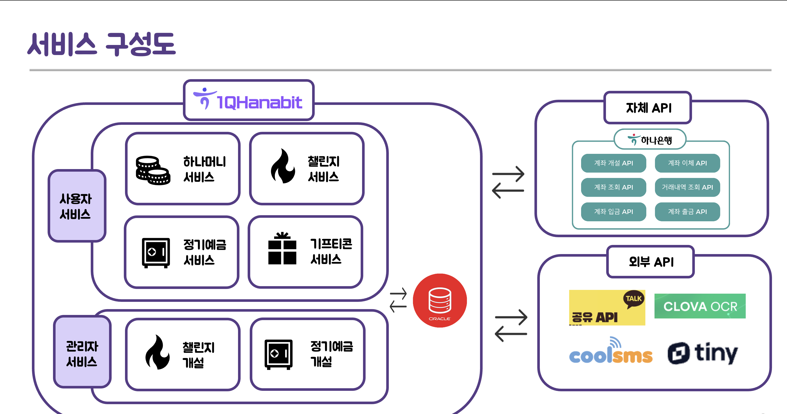
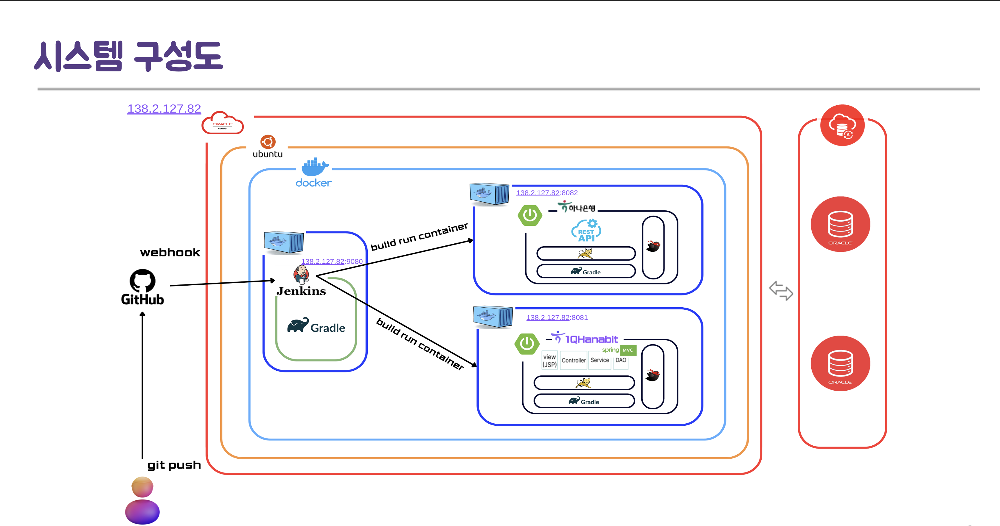
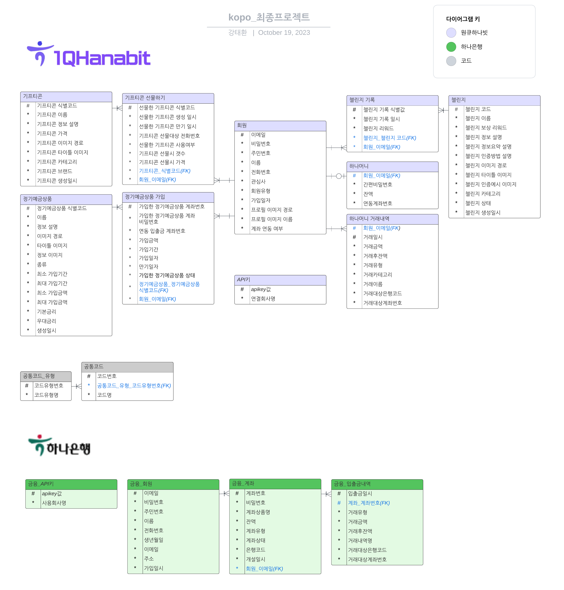
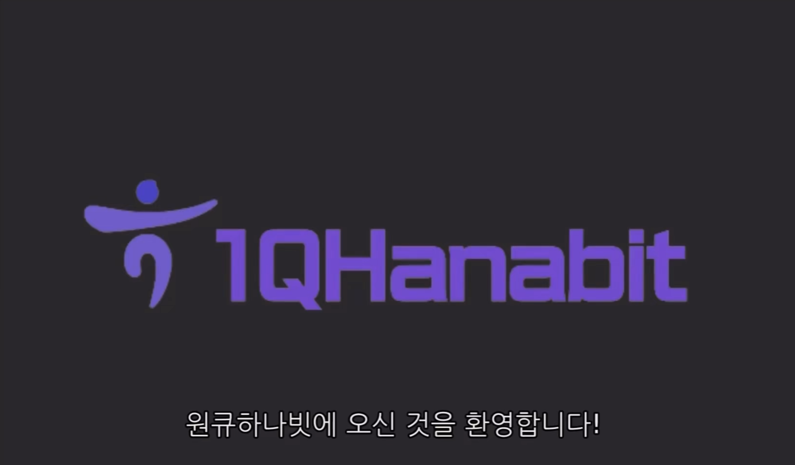

# 1Q로 한번에 저축습관과 생활습관까지 금융과 챌린지의 결합 서비스 플랫폼 - 원큐하나빗(1QHanabit)

[프로젝트 홈페이지](/)

# 1. 프로젝트 소개

### 1-1. 프로젝트 기획배경

• 최근 고금리, 고물가 시대에 짠테크(앱테크)의 관심도는 높아지고 있음. <br/>
• 자기개발과 갓생을 중요시 여기는 MZ세대들에게 습관형성 챌린지 서비스의 관심 급증. <br/>
• 한국은행의 '금융기관 여수신이율 등에 관한 규정'이 개정되면서 많은 금융회사가 초단기 금융상품을 도입. <br/>

 <br/>


### 1-3. 개발환경

```
- OS : mac m1, ubuntu 22.04(arm)
- Framework : Spring Boot 2.7.16, Mybatis 2.3.1
- Server : tomcat9
- Tool : Eclipse, IntelliJ, Sql Developer, SourceTree
- VCS : Github
- DBMS : Oracle DBMS
- CI/CD : Jenkins
- Cloud : Oracle Cloud
- Build : gradle 8.2.1
- ETC : Docker
```

### 1-4. 수행기간

개발기간: 2022.09.01 - 2022.10.20 <br/>

 <br/>

# 2. 프로젝트 제안서

[프로젝트 제안서](/제안서.pdf)

### 2-1. 프로젝트 서비스 목표
 <br/>
• 이에 따라서 리워드 + 챌린지 + 금융 이라는 각각의 별개의 서비스를 결합하는 새로운 서비스를 고안. <br/>
• 본 서비스를 요약하자면 "챌린지를 통하여 하나머니로 리워드를 얻고, 챌린지 횟수에 따라 우대금리를 적용해주는 단기정기예금이 있는 플랫폼". <br/>


### 2-2. 프로젝트 목적 및 주요기능
 <br/>
• 본 서비스로 기존 금융을 이용하던 고객들에게 챌린지를 통한 새로운 형태의 금융상품을 제공함으로서, 저축에 대한 재미를 더해 펀세이빙을 하기 원하는 펀슈머들을 유입. <br/>
• 또한, 생활습관을 개선하고 자기개발에 관심이 있는 고객들을 금융의 새로운 고객으로 유입할 수 있음. <br/>


### 2-3. 사용 기술

• Spring MVC 기반 웹 페이지 제작 <br/>
• 가상의 하나은행 REST API 서버 제작 및 OCI를 통한 배포 <br/>
• CoolSMS를 통한 SMS 본인인증 및 기프티콘 선물하기 <br/>
• Jenkins와 Docker를 통한 테스트, 빌드 및 배포 자동화 <br/>
• Clova OCR API를 통한 챌린지 인증 및 신분증 인증 <br/>
• SpringScheduler를 통한 정기예금상품 만기 시 자동이체 <br/>
• Interceptor를 통한 일반회원과 관리자의 접근 페이지 분리 <br/>
• FullCalendar 라이브러리를 활용한 인증 챌린지 캘린더 구현 <br/>
• Java Mail Sender와 Gmail SMTP API를 활용한 메일 인증 <br/>
• Kakao 공유 API를 통한 챌린지 공유 메시지 발송 <br/>


 <br/>

# 3. 프로젝트 결과

### 3-1. 서비스 구성도

 <br/>

• 외부에 구축된 가상의 마이데이터 API를 통해 타 증권사 계좌 정보 입력 <br/>
• 장 마감 이후, 당일의 주식 정보를 스케쥴러를 통해 자동으로 업데이트 <br/>

### 3-2. 시스템 구성도
 <br/>

### 3-3. ERD

 <br/>

## 발표 ppt

[발표자료](/원큐하나빗.pdf) <br/>

## 시연 동영상

<a href="https://o365kopo-my.sharepoint.com/:v:/g/personal/2360340003_office_kopo_ac_kr/ESRr2ZG6GYRMtJgUu0MSDSMBIFp4u73l6Nh7-Z2skqsDUg?nav=eyJyZWZlcnJhbEluZm8iOnsicmVmZXJyYWxBcHAiOiJPbmVEcml2ZUZvckJ1c2luZXNzIiwicmVmZXJyYWxBcHBQbGF0Zm9ybSI6IldlYiIsInJlZmVycmFsTW9kZSI6InZpZXciLCJyZWZlcnJhbFZpZXciOiJNeUZpbGVzTGlua0RpcmVjdCJ9fQ&e=KODHSa"></a><br/>

# 4. 본인 소개

| 구분          | 내용                                                                                             | 비고                                 |
|---------------|--------------------------------------------------------------------------------------------------|--------------------------------------|
| 이름          | 강태환                                                                                          |                 |
| 연락처        | 2360340003@office.kopo.ac.kr                                                                     |                                      |
| Frontend skill| HTML, CSS, Javascript, BootStrap                                                                 |                                      |
| Backend skill | Java, Spring, Oracle                                                                             |                                      |
| ETC           | Docker, Jenkins, Git                                                                             |                                      |
| 자격증        | SQLD(SQL개발자)                                                                                  | 2023.04.14                           |
|               | OPIC(IM2)                                                                                        | 2023.01.08                           |
|               | 정보처리기사 (SQLD자격)                                                                           | 2021.08.20                           |
| 대외/내 활동사항 | 교내 캡스톤 디자인 (졸업프로젝트)                                                           | 2022.11.01                           |
|               | 인천대학교 앱센터 (웹 프로젝트 개발)                                                       | 2021.03.01 ~ 2021.06.30              |
| 교육활동      | 하나금융티아이 채용전환형 교육 1200시간( 한국폴리텍대학교 광명융합기술교육원 - 데이터분석과 )  | 2023.03.02 ~ 2023.10.20 (1200시간)   |
|               | 광주인공지능사관학교(광주광역시)                                                                 | 2021.04.19 ~ 2021.12.07 (960시간)    |


